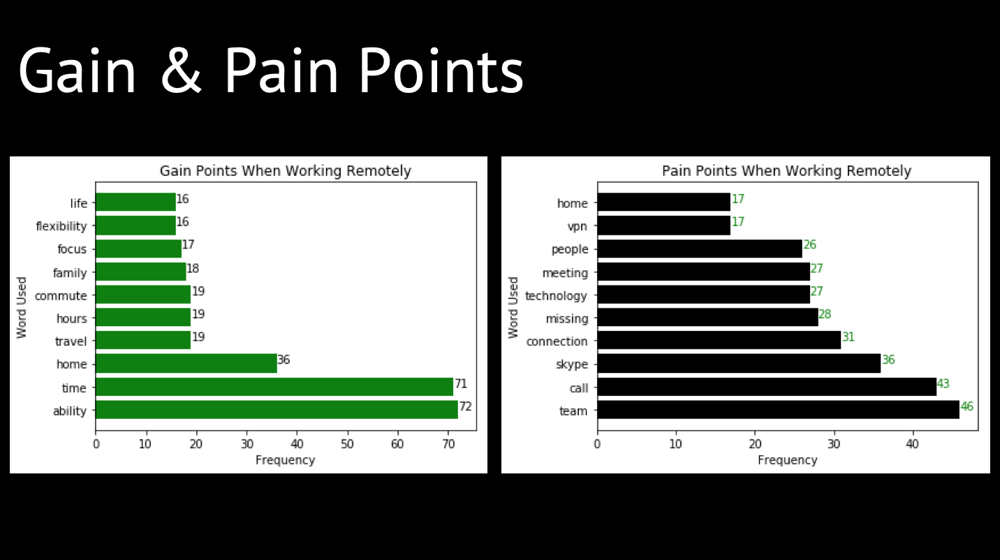
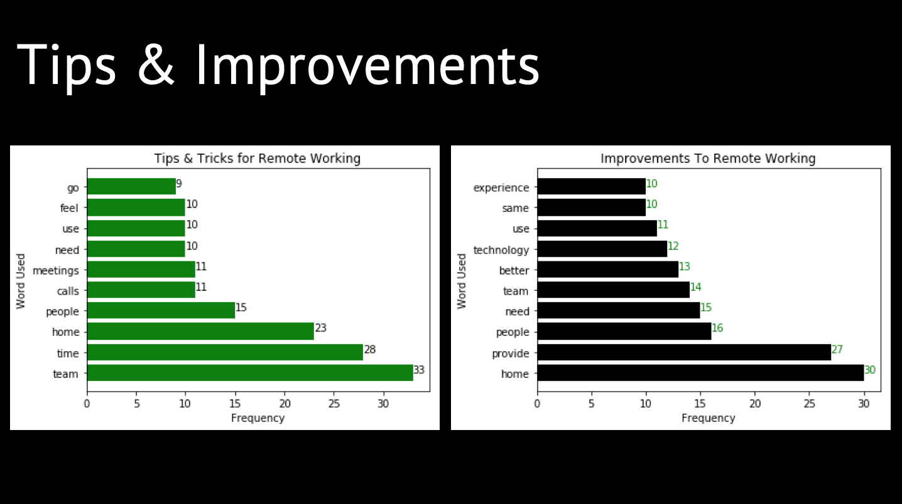

> Technology is developing at a rapid pace, bringing in new means of communication. In this project, we were investigating whether technology has changed the way people communicate with each other in the context of remote working.

The Virtual Office project was an intiative proposed by Deloitte Australia in a bid to provide their employees a hybrid way of working. A survey regarding this initiative was conducted by Deloitte Sydney, in which the respondents were asked to provide feedback on their experience of working from home. The crux here was the data structure as the responses were unstructured text. The analysis had to be done by firstly quantifying the text responses so useful information could be extracted. This was done in Python. The word frequency was then counted and ranked. A particular focus was on the top 10 words for each category.

Here are two slides from the project design presentation.

)

