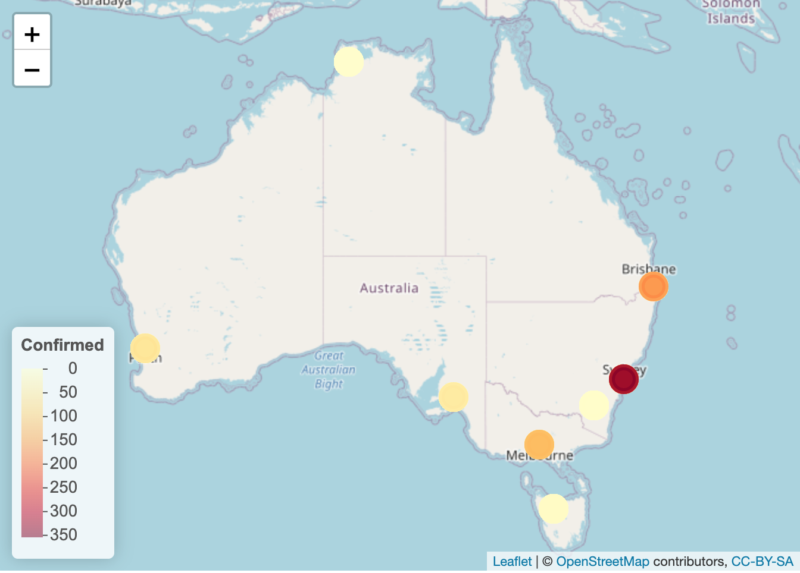
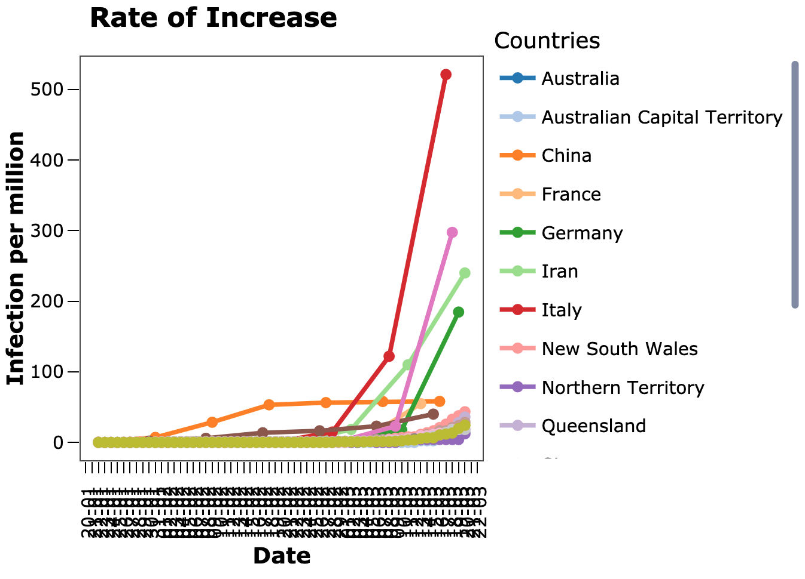
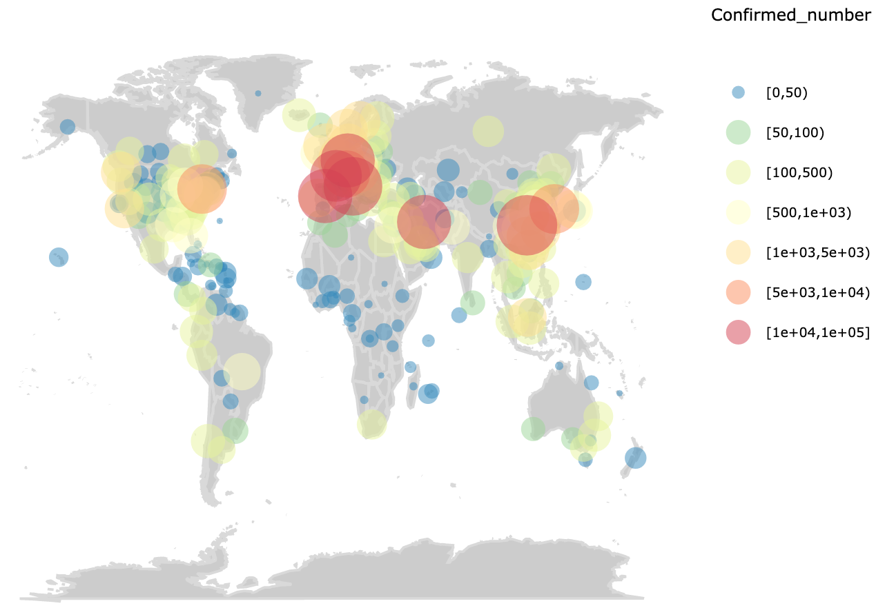

> Please do the following things to protect those who are protecting us: Mask wearing, physical distancing, staying at home when you are unwell and getting tested, practicing good hand hygiene and cough etiquette. Stay up to date with the health advice in your jurisdiction.

__Cases by State__

The spatial distribution of confirmed cases within Australia was plotted to illustrate the severity of the situation in each state on a colour scale with purple being the most severe, that is, having the most confirmed cases and beige being the least severe. As of 21/3/2020, most confirmed cases of the coronavirus disease were in New South Wales. The State observed a surge in coronavirus cases after passengers being allowed to disembark from the Ruby Princess cruise ship. Cases of community transmissions had also been reported.

__Rate of increase__

A line plot was used to track the change in confirmed cases. Infections per million was calculated and plotted instead of the actual number of cases to improve the readibility.

__Geographical distribution of cases__

As of 21 March, Europe had the most confirmed cases, followed by Asia and North America. Australia was doing okay at that stage.

All plots can be interactive by using ggplotly.

